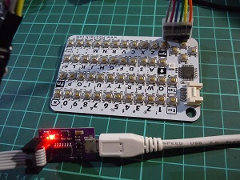

# CardKeyBoard PS/2 インタフェース版

  

## はじめに
本ソフトウェアは、M5stak用の**CardKeyBoard** をPS/2インタフェース対応のにするファームウェアです。  
PS/2キーボードを使うマイコンボード等での利用を目的としています。  
**IchigoJam V1.3**、**豊四季Tiny BASIC for Arduino STM32 V0.87** での動作を確認しています。  

実装はArduino環境を利用しています。  
本ファームウェアは、**CardKeyBoard**のオリジナル版ファームウェアのソースを修正して開発しています。

CardKeyBoardのオリジナル版のソース  
- Github m5stack/M5-ProductExampleCodes  
https://github.com/m5stack/M5-ProductExampleCodes/tree/master/Unit/CARDKB

上記のオリジナル版を書き込むことで元に戻すことが出来ます。

本ソフトウェアは自由にお使いください。  

## 注意
本、ソフトウェアを使ってCardKBが利用不能になっても、責任は持てません。  
また、メーカーの保証が受けられなくなる可能性があります。  
あくまでも、自己責任の改造とご理解の上、利用願います。  

## インタフェース仕様
オリジナルのI2Cインタフェースから、PS/2インタフェースに変更しています。

  

|端子・導線|  信号  |
|:--:|:--:|
|黒   |GND  |
|赤   |5V or 3.3V  |
|黄   |CLK/D+(A4)  |
|白   |DATA/D-(A5) |

USBコネクタ（オス）を利用する場合は、上記導線を下記の端子に結線して下さい。  
  

## キーボード仕様
オリジナル版では、起動時のLED（NeoPixcel）が点滅しますが、本ファームウェアでは点滅しません。  

ホストコンピュータの利用キーボードは日本語キーボードを指定して下さい。  

キーボードの仕様及び機能はオリジナルとほぼ同じですですが、  
下記のキー割り付けを新たに追加しています。  

|キー機能|  操作  |
|:--|:--|
|[F1]|[1]＋[Fn]
|[F2]|[2]＋[Fn]
|[F3]|[3]＋[Fn]
|[F4]|[4]＋[Fn]
|[F5]|[5]＋[Fn]
|[F6]|[6]＋[Fn]
|[F7]|[7]＋[Fn]
|[F8]|[8]＋[Fn]
|[F9]|[9]＋[Fn]
|[F10]|[0]＋[Fn]
|[Insert]|[BS]＋[Fn]
|[Home]	|[←]＋[Fn]
|[PageUp]|[↑]＋[Fn]
|[カナ]	|[k]＋[Fn]
|[PageDown]	|[↓]＋[Fn]
|[End]|[→]＋[Fn]

[F1]～[F10]はファンクションキーです。  

## スケッチのコンパイルに必要なライブラリの用意
- Adafruit NeoPixelライブラリ
Arduino IDEのライブラリマネージャーにて、"Adafruit NeoPixel"にて検索し、インストールします。  
  

- ps2dev（Emulating a PS2 device）  
    - [PS2 mouse interface for Arduino](http://playground.arduino.cc/ComponentLib/Ps2mouse)から一番下の **Attach:ps2dev.zip** をクリックしてダウンロードします。  
    - 解凍して、各自のArduino環境の **libraries** の下に配置します。  
    - **ps2dev.cpp** をエディタで開き`#include "WProgram.h"`を`#include "Arduino.h"`に修正し保存します。
    - **ps2dev.h** をエディタで開き`#include "WConstants.h"`をコメントアウト（`//#include "WConstants.h"`)し保存します。

## ファームウェアの書き込み
**Arduino IDE** にて添付のスケッチをコンパイルして書き込むか、  
**bin**フォルダ内のコンパイル済みイメージファイル **CardKeyBoard.ino.hex**を  
**avrdude**等のツールを使って書き込んで下さい。  
プログラマは各自の使い慣れたものをお使い下さい。  

(注意) ヒューズビットの変更は行わないで下さい。    
**ProgIsp**をお使いの場合は、デフォルトの**Program Fuse**の設定を無効にして下さい。  

### Arduino IDEを使った書き込み  
本プロジェクトに添付の **CardKeyBoard.ino** をArduino IDEで開きます。  
Arduino IDE環境にて、ボード選択として、**Arduino Pro（3.3V 8MHz）** を指定して書き込みます。  

(ブートローダの書き込み操作（[ツール] - [ブートローダを書き込む]）は禁止）
 
ボードには、ブートローダは搭載していないため、ICSP端子からのプログラマ（ArduinoISP、USBasp、USBtinyISP等）による書き込みが必要です。  
プログラマは各自の使い慣れたものをお使い下さい。  

ボード上のICSP端子の仕様  
  

上記端子にジャンパーを差し込んで、簡易的に接続でも書き込み出来ます。  
（テープ等で固定等の工夫を行って下さい）

   

プログラマとして **USBtinyISP** を使った例  
  

書き込みはIDEメニューの **[スケッチ] - [書込装置を使って書き込む]** にて、  
スケッチをコンパイルし、書き込みを行います。  

## USBコネクタ経由で接続するための簡易ケーブルの実装例  

USB端子（オス）、ジャンパーワイヤー（オス-オス）を使って、簡易ケーブルを実装した例です。  

**豊四季Tiny BASIC for Arduino STM32 V0.87**の利用例  

秋月電子の「[ケーブル取付用ＵＳＢコネクタ（Ａタイプ　オス）](http://akizukidenshi.com/catalog/g/gC-07664/)」を使た例  
(熱収縮チューブ＋結束バンドで根本を補強)  

  

  

## IchigoJamでKBD1、KBD2に接続して利用する例

IchigoJamで利用する場合、  
ジャンパーワイヤー（オス - オス）を使って、端子に接続でも利用出来ます。  

|IchigoJamの端子|  キーボードのケーブル  |
|:--:|:--|
|GND|黒：GND
|VCC|赤：5V or 3.3V
|KBD1|黄：CLK/D+
|KBD2|白：DATA/D-

